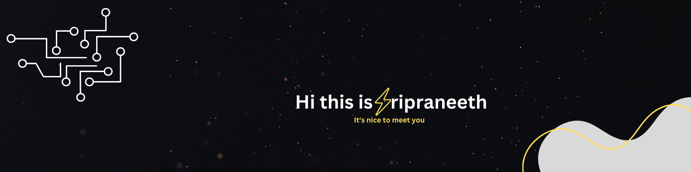

  

# Hi 👋, I'm Sripraneeth Salapareddi

### A passionate Computer Vision Developer from India

- 🔭 Currently working with **AWS Bedrock and marketplace LLMs** to build **end-to-end AI applications**, including **RAG pipelines** and **serverless inference systems**

- 🌱 Exploring **advanced AI systems**, including **RAG pipelines**, **cloud-based LLMs**, and **3D computer vision using Open3D**

- 💬 Ask me about **real-time computer vision systems for inspection and surveillance in industrial environments**

- 📫 Reach me at **sripraneethsalapareddi@gmail.com**

## 🔗 Connect with me

## 🛠️ Languages and Tools

  
  
  
  
  
  
  
  
  
  
  
  
  
  
  
  
  
  
  
  
  

